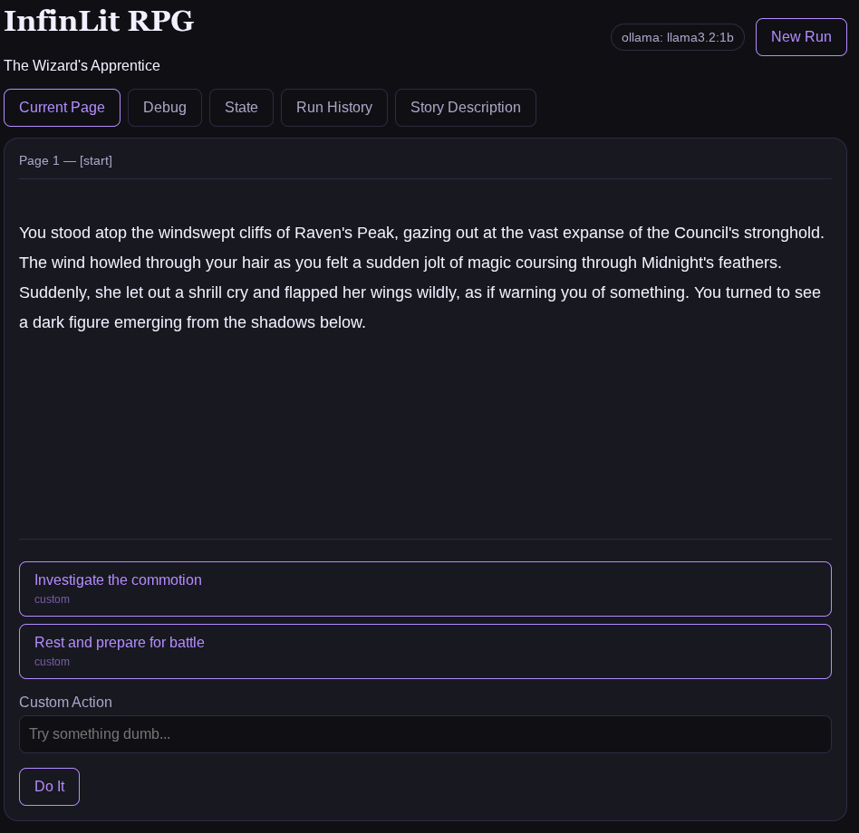

# InfinLit RPG

InfinLit RPG is a local-first AI-powered interactive fiction engine that combines structured game state, persistent world memory, and local LLMs through Ollama.

Current focus:

* Persistent story generation
* Structured state management
* Save and load runs
* Local AI integration
* Prompt engineering experimentation
* Bring-your-own-model architecture

> ⚠️ Status: Experimental MVP
>
> Expect bugs, strange behavior, and occasional goblins.

---

## Requirements

* Git
* Node.js
* Ollama
* At least one Ollama-compatible model

**InfinLit RPG does not include or redistribute model weights. Users are responsible for installing Ollama and choosing models according to those models' licenses.**

---

## Installation

### 1. Install Ollama

Visit:

https://ollama.com

After installation, pull a model:

```bash
ollama pull llama3.1:8b
```

Other models may work, but results will vary.

### 2. Install Node.js

Visit:

https://nodejs.org

### 3. Clone the Repository

```bash
git clone https://github.com/sleighterror/infinlit_rpg.git
cd infinlit_rpg
```

### 4. Install Dependencies

```bash
npm install
```

### 5. Configure Environment

Copy the example environment file:

```bash
cp .env.example .env
```

Edit `.env` as desired.

Example:

```env
MODEL_PROVIDER=ollama
OLLAMA_MODEL=llama3.1:8b
OLLAMA_URL=http://localhost:11434/api/generate
PORT=3000
```

---

## Running InfinLit RPG

Make sure Ollama is running and the selected model is available.

Start the application:

```bash
npm run start
```

Open a browser and visit:

```txt
http://localhost:3000
```

---

## Project Goals

InfinLit RPG is intended as both:

* A playable AI-powered interactive fiction engine
* A reference project for local LLM game development

The project explores techniques such as:

* Structured game state
* Long-term story memory
* JSON response contracts
* Local-first AI workflows
* Prompt-driven game systems

---

## Contributing

Issues, suggestions, experiments, and pull requests are welcome.

---

## Support

If you enjoy weird software experiments, visit:

https://sleighterror.com

---

## License

MIT License
